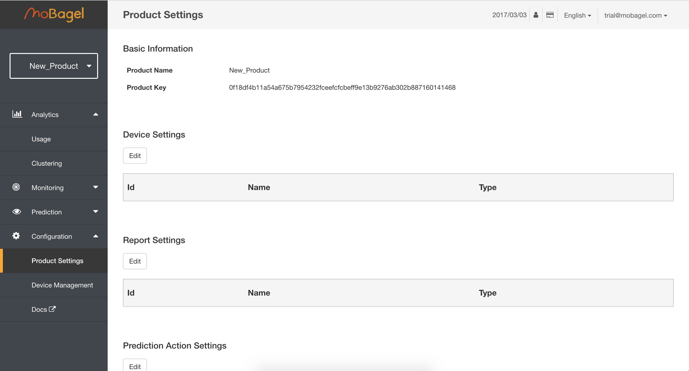

# MoBagel Dashboard

----
## Introduction

Welcome to the **`MoBagel Dashboard`**, a snapshot of your devices for easy tracking and analysis.  

In this tutorial, we will guide you through how to upload data to the MoBagel Dashboard.

----
## Uploading your data  

With the `MoBagel data uploading tool`, you can easily upload your .csv data to process on the MoBagel Dashboard.

---

Type in a name for your product.    
 

---
Click on continue.    
 

---
Find the `Product Key` under Product Settings.    
 

---
Set up your `Report Settings` under Product settings.    
 

---
Copy the `Product Key`.    
 

---
Open the MoBagel data uploading tool.    
 

---
Find the .csv file you would to upload.    
 

---
Here you can see what your data looks like.    
 

---
Here you can see all the data types of your data.    

---
You will need to come here and Copy the `Product Key` if you haven't yet.     
 

---
On the third tab `Analyze` you will find a place to fill in the `Product Key`.    
 

---
Paste the `Product Key`.    
 

---
Click on Submit and upload.    
 

---
Return to the dashboard and find your new device under `Device Management`.    
 

---
Click on the device and you will find that all your data has been uploaded.    
 

---

----
## Your Current Products  

On the left hand side of the dashboard, under the MoBagel logo, a drop-down menu will list the products you have already created.  

  

To create a new one, simply click on **`+New Product`**.    

  

----
# The Dashboard

Listed below follows the order of the left menu on the MoBagel dashboard, skip to the page that most interests you or follow along and see what MoBagel's dashboard can do!

* Analytics
    + [Usage](#Usage)
* Monitoring
    + [Real Time](#Real_Time)
    + [Notification](#Notification)
* Prediction
    + [Recommendations](#Recommendations)

  

----

## Analytics

### Usage 

* `Usage` allows you to have a quick overview of all your devices all on one page, showing the number of users with regard to the time.

      

* On the upper right hand side, click on `Day`, `Week`, `Month` or `Year` and the graph changes along with `Peak Usage` and `Lowest Usage` underneath.

    

>* `Total Users`
    * Shows all the current devices available
>* `Active Users`
    * Shows devices currently active, this information can also be found in **_Configuration -> Device Management_**
>* `Peak Usage`
    * Indicated at the highest point in the graph above.
>* `Lowest Usage`
    * Indicated at the lowest point in the graph above.

* On the upper right hand side we will also find some useful tabs under Day, Week, Month, and Year for manipulating the user frequency graph.

    
    

    ----
    *  - `Zoom`  
        * Choose a timeframe by clicking on Zoom once, then select the area on the graph you would like to magnify. Repeat to zoom in again.

    ----
    *  - `Reset`
        * Graph goes back one step each time you click on Reset.
    
    ----
    *  - `Raw Data`  
        * See Raw Data used to create the graph, click on “close” on the lower-right hand side to return to graph.
    
    ----
    *  - `Line`  
        * Line graph is set as default.

    ----
    *  - `Bar`
        * Click on Bar to show data as a Bar graph.

    ----
    *  - `Save as Image`
        * Download current graph shown.  

----  
* `Last Usage`  
      

    * See how many reports were sent each hour for the last 24 hours. Place mouse cursor on bar for details.

----
* `Last Usage Detail`
    
    * Time
        * Last time a report was sent.
    * Total Devices
    * Total Reports
    * See More In Segmentation
        * Click to filter customised results in the “Segmentation” page.  

----  
* `Property Breakdown`
    
    * Listed here are all sensor properties sent in each report, also showing the range of values for each property.
        * Numeric Property
        * Category Property

----
* `Usage Location`
    * Manage your devices and see where they are located from latitude and longitude data in the report.
        * Country
        * User
        * %User

  

----

### Segmentation
* `Condition`  
    
    ----
    * Create a segment using filters, for a specific timeframe or property states
    
    ----
    * Click on `Add rule` on the right hand side
    
    ----
    * Click on `Add group` for more complex filtering
    * Select the properties you would like to filter with `AND` / `OR`.
    
    
    * e.g. "state equal normal" `AND` "temperature_C is greater than 30” `AND` ("light_pct is null" `OR` “period_s is not null”)

----
* `Series`
    
    ----
    * Analyse the segment by comparing different series.
    
    ---- 
    * Click `+Add` to create a new series.
    
    ----
    * Add as many series you would like to compare.
    
    * e.g. We would like to see the a series that shows “state equal normal” and compare this to another series “temperature_C greater 33” on the same graph

----
* `Select Y-Axis`
    
    ----
    * Configure your result to display the number of devices, number of reports, or property with respect to time.
    
    
    ----
    * e.g. Here we choose `Device`.
    

----
* `Select Chart Type`
    
    ----
    * Line graph is set as default.
      

----    
* `Result`
    
    ----
    * Scroll to the bottom of the page to generate results.
      
    ----
    * Set the time frame on the right hand side
     
    ----
    * e.g. 12/01/2015 - 12/03/2016
     
    ----
    * Click `Generate`, this will need to be done every time there are changes made to the filters above.
     
    ----
    * Click on the name of the series to hide/show it on the graph.
     
    ----
    * `Zoom`, `Reset`, `Raw Data`, `Line`, `Bar` and `Save as Image` work the same way as mentioned before.

  

----
## Monitoring

### Real Time

* If you have not set up any monitoring or alerts, click on the blue `Set up now` button. You will then be taken to the `Notification` page.
* Continue this part after you have configured your settings in `Notificaiton`.
     
* All changes from your device reports will show on screen in real time, coming from the right.
    

  

----
### Notification
* Click on `Configure Notification` to set up monitoring for your product. 

* Current Notification Method
    - Your currnet method of notification is shown here.
    

* Configure Method
    - Your currnet method of notification is shown here.
    

* Configure Normal Ranges
    * If you have not set up `Device Settings` you will find nothing here.
    
    * Configure your normal ranges here by clicking on the `Edit` button. If your report values exceed the ranges, you will receive a notification.
    

      

----
## Prediction

### Recommendations

----    
* On the top of the page, you can decide the frequency of the data and the time window you would like to observerve.

    
    ----
    * The `History`(Red Line) and `Prediction`(Dotted Line) of your report data will be shown here.
    
    ----
    * Click on `Prediction` to hide `Prediction`.
     
    ----
    * Click on `History` to hide `History`.
    
    ----
    * Suggestions for various actions will be listed on the right hand side.
    
